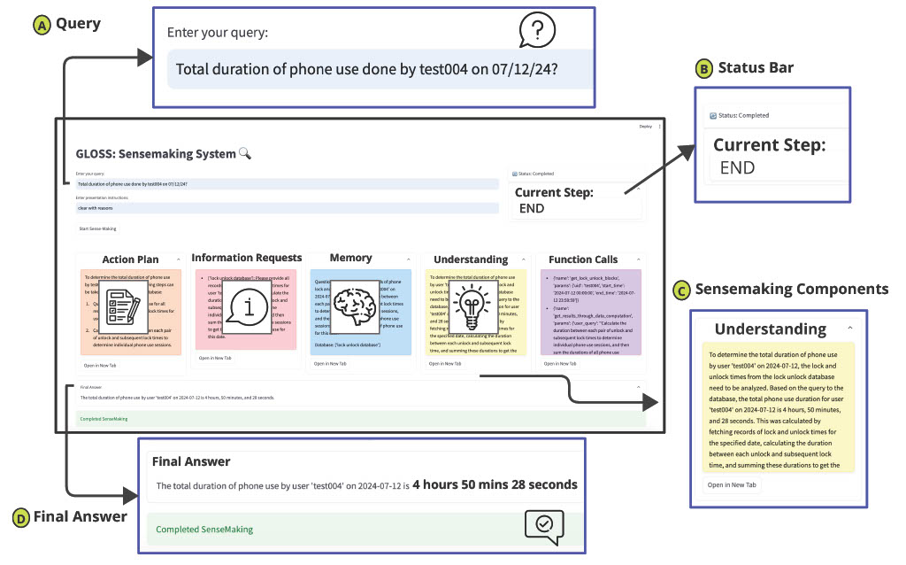

# DAIMON Backend Setup Guide

This is the backend of **DAIMON**, an AI-augmented research dashboard for longitudinal sensing studies. It is built on **GLOSS** (Group of LLMs for Open-Ended Sensemaking), which powers the dashboard's natural-language queries over sensing data, plus a Flask API (`dashboards_backend/`) that serves the dashboard [frontend](../frontend).

* GLOSS repository: [UbiWell/GLOSS](https://github.com/UbiWell/GLOSS)
* 📚 [Full paper for GLOSS](https://dl.acm.org/doi/10.1145/3749474)

This guide walks you through setting up the backend on your local machine.

## Prerequisites Setup

### 1. Install Required Software

- **Anaconda**: Download from [anaconda.com](https://anaconda.com) if not already installed
- **Docker**: Download from [docker.com](https://docker.com) if not already installed  
- **Git**: Most computers have this, but download from [git-scm.com](https://git-scm.com) if needed

## Getting the Code

### 2. Download the Repositories

Open your terminal/command prompt and navigate to your working directory 

```bash
# Clone the DAIMON repository
git clone https://github.com/UbiWell/DAIMON.git
# or using SSH:
# git clone git@github.com:UbiWell/DAIMON.git
```

Clone the stress detection algorithm inside the `backend` folder. GLOSS uses stress detection models by  📚[Varun et al](https://pmc.ncbi.nlm.nih.gov/articles/PMC9523764/) to detect stress using IBI data

```bash
cd DAIMON/backend

git clone https://github.com/UbiWell/stress-detection-algorithm-code-python.git
# or using SSH:
# git clone git@github.com:UbiWell/stress-detection-algorithm-code-python.git
```
Your folder structure should now look like:
Working dir/DAIMON/backend/stress-detection-algorithm-code-python

***What this does:*** Downloads the DAIMON code and the stress detection models it needs.

## Setting Up Python Environment

### 3. Create the Conda Environment

```bash
# Go into the backend folder if it's not your current directory
cd DAIMON/backend

# Create a new Python environment (The default name is gloss-sensemaking)
conda env create -f environment.yml (OPTIONAL: -n preferred-env-name)

# Activate your new environment
conda activate gloss-sensemaking (or preferred-env-name)
```
***What this does:*** Creates an isolated Python environment with all the right packages so the backend works correctly.

### 4. Setting up Config and ENV variables
Go to `agents/config.py` and set up config variables. By default, GLOSS uses GPT-4o:

```bash
USE_AZURE = False #(True if using Azure deployment)
USE_GPT5 = False #(True if using GPT-5)
ONLY_CODE_FUNCTIONS = True #(True if all runs use code generation)
VERBOSE = True #(True if need more verbosity when running sensemaking_process.py)
USE_CSV = True #(True if using CSV as data, keep it true as demo uses csv data)
DOCKER_NAME = "gloss-sensemaking-code" # (name of Docker to run LLM-generated code)
GLOSS_ROOT = ... # (folder where LLM-generated code runs; defaults to this repo, override with the GLOSS_ROOT env variable)
```

#### Set ENV variables:
OPENAI_API_KEY or AZURE_OPENAI_API_ENDPOINT and AZURE_OPENAI_API_KEY based on whether you are calling OpenAI APIs directly or through Azure deployment.

***Example***
```bash
export AZURE_OPENAI_API_KEY="your_api_key_here"
Save and reload your shell:

source ~/.bashrc   # or ~/.zshrc
```
## Docker Setup

### 5. Add Your API Keys
* **Open the `Dockerfile` in the `backend` folder**
* **Find the environment variables section**
* **Replace the `"add your key"` placeholders with your actual API keys.** Set `OPENAI_API_KEY`, or uncomment and set `AZURE_OPENAI_API_KEY` and `AZURE_OPENAI_API_ENDPOINT` if you use Azure.

> ⚠️ Never commit your real keys. Keep your filled-in `Dockerfile` local, or pass keys at runtime with `docker run -e OPENAI_API_KEY=...`.

### (Optional) Connect Your Own MongoDB
Not needed for the demo, which reads the CSV files in `sample_data/` (`USE_CSV = True`). To use your own MongoDB instead, set `USE_CSV = False` in `agents/config.py` and give GLOSS your connection details in one of two ways:

* **Edit `data_processing/mongo_config.py`** and replace `host`, `port`, `database`, `username` and `password` with your values, or
* **Set the `MONGO_URI` environment variable**, which overrides `mongo_config.py`:
  ```bash
  export MONGO_URI="mongodb://<username>:<password>@<host>:<port>/<database>?authSource=<database>"
  ```
  Inside Docker, uncomment the `MONGO_URI` line in the `Dockerfile` instead.

### 6. Build the Docker Container
```bash
# From the backend folder, build the Docker image  (this may take a few minutes)
docker build -f Dockerfile -t gloss-sensemaking-code . # (use the name set up in config)
```
***What this does:*** Creates a containerized environment that packages everything GLOSS needs to run consistently.

## Running GLOSS
### 7. Sample Data
The first author provided one day (08/28/2025) of their data as sample data, except location database in CSV Format. 
So after setting up GLOSS, users can query the data.

**Study documents:** the files in `study_docs/` are **samples only**, there so the study-documents search has something to answer from:
* `Dummy_Study_Protocol.txt` is a **dummy, fictional** study protocol that describes the Garmin and phone data streams in general terms (e.g. *"How often should participants charge the watch?"*). It does not describe a real study.
* `Public_Reference_Garmin_and_EMA.txt` summarizes **publicly available** information: how Garmin's stress level and Body Battery work, from Garmin's owner's manuals, and published research on designing EMAs (e.g. *"Does sending more prompts per day lower EMA compliance?"*). Its sources are listed at the end of the file. It is not official guidance from Garmin or the cited authors.

Replace these with your own consent forms, protocols or onboarding guides: every `.txt` file in `study_docs/` is picked up automatically.

### 8. Customize and Run
```bash
# Edit the main script to set your research question
vi sensemaking_process.py  # or use your preferred editor
```
```python
# Change presentation instructions and query to run:
# Example shown below
presentation_instructions_ = '''
clear and concise
'''
query = '''
on aug 28 2025, for test004 what was most used app by duration?'''
SenseMaker(
   query,
   presentation_instructions_).make_sense(verbose=VERBOSE)
```

```bash
# Run GLOSS!
python sensemaking_process.py
```
***What this does:*** Starts the sensemaking process with your custom query.

GLOSS runs the sensemaking process and you can see every step of the process and the final answer.

### 9. You can also use GLOSS UI for running queries
 ```bash streamlit run sensemaking.ui ```

 [ Figure 1: Sensemaking Process ](images/sensemaking_ui.jpg)

## Running the DAIMON Dashboard Backend
### 10. Start the dashboard API
The dashboard frontend talks to the Flask API in `dashboards_backend/`. From the `backend` folder, with your conda environment active:
```bash
python dashboards_backend/wsgi.py   # serves the API on http://localhost:5050
```
Point the frontend's `VITE_API_URL` at this address (it is the frontend's default).

### 11. Log in to the dashboard
The backend ships with one example account:

| Username | Password |
| --- | --- |
| `TestUser` | `daimon123` |

To add your own users, edit `valid_credentials` in the `login` route of `dashboards_backend/app.py`.

> ⚠️ This is a simple demo login with plain-text passwords. Change the example password and don't commit real credentials before deploying anywhere public.

### 12. Deploying to a server (optional)
`dashboards_backend/PRODUCTION_DEPLOYMENT.md` is an example deployment guide (Gunicorn + systemd + nginx), with `dashboards_backend/gunicorn_config.py` and the nginx template `dashboards_backend/nginx.conf.example`. Before using them, replace the placeholders with your own values:

| Placeholder | Replace with |
| --- | --- |
| `your-domain.example.com` | Your server's domain name |
| `/path/to/GLOSS` | The `backend` folder of your DAIMON clone on the server |
| `/path/to/gloss-dashboard` | The `frontend` folder of your DAIMON clone, after `npm run build` |
| `/path/to/miniconda3` | Your conda installation |
| `/path/to/logs`, `/path/to/tmp` | Folders for server logs and temporary files |
| `/path/to/.env_vars` | A file with your environment variables (API keys, `MONGO_URI`) |

## Adding your own database
#### 1. Copy the template:
   ```bash
   cp data_streams/database_template.py data_streams/my_new_database.py
   ```
#### 2. Uncomment the code as code in my_new_database.py is commented. Fill in the metadata:
   ```python
   database_info = {
       "name": "my_new_database", 
       "info": "Description of your database",
       "device": "Phone",  # or "Watch", "Sensor", etc.
       "additional_instructions": "Any special instructions"
   }
   ```

#### 3. Add function metadata for LLMs:
   ```python
   functions = {
       "FUNC1": {
           "name": "get_my_data",
           "description": "Retrieves data from your database",
           "usecase": ["code_generation", "function_calling"],
           "params": {
               "user_id": {"type": "str", "description": "User identifier"},
               "start_time": {"type": "str", "description": "Start time"},
               "end_time": {"type": "str", "description": "End time"}
           },
           "returns": "A list of data records",
           "example": "[{'timestamp': '2024-01-01 12:00:00', 'value': 42.5}]"
       }
   }
   ```

#### 4. Add your actual function implementations:
   ```python
   def get_my_data(user_id: str, start_time: str, end_time: str):
       # Your implementation here
       pass
   
   function_refs = {
       "get_my_data": get_my_data
       # Add more functions
   }
   ```

#### 5. That's it! The registry will automatically discover and load your new database.

   ```python
   database_info = {
       "name": "my_new_database", 
       "info": "Description of your database",
       "device": "Phone",  # or "Watch", "Sensor", etc.
       "additional_instructions": "Any special instructions"
   }
   ```

#### If you use this code please cite:
***Akshat Choube, Ha Le, Jiachen Li, Kaixin Ji, Vedant Das Swain, and Varun Mishra. 2025. GLOSS: Group of LLMs for Open-ended Sensemaking of Passive Sensing Data for Health and Wellbeing. Proc. ACM Interact. Mob. Wearable Ubiquitous Technol. 9, 3, Article 76 (September 2025), 32 pages. https://doi.org/10.1145/3749474***


**Feel free to open issues in the repository or contact choube.a@northeastern.edu if you need additional help setting up GLOSS locally.**